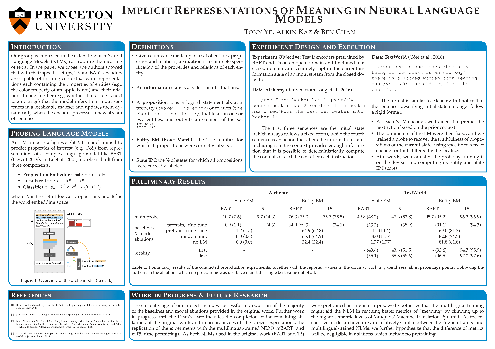

# Implicit Representations of Meaning in Neural Language Models

## Alkin Kaz, Tony Ye, Benjamin Chan



This is the repository for our final project of COS484: Natural Language Processing (Spring 2022). For our project, we replicated experiments from the 2021 ACL paper [Implicit Representations of Meaning in Neural Language Models](https://aclanthology.org/2021.acl-long.143/) by Li et al. and contributed our original ablation experiments. This repo has been forked from the original [repo](https://github.com/belindal/state-probes) that the authors provide. The code we have written on top of the preexisting codebase can be seen in the `./blames` directory, but summarized here for your convenience:

1) `./slurm_scripts`: Since we ran our jobs in [Adroit cluster](https://researchcomputing.princeton.edu/systems/adroit), considerable effort was spent on writing SLURM jobs to be executed in the cluster. The provided scripts are not a complete list but constitutes the necessary majority that covers enough ground to more easily replicate for the multilingual models (m-models) later on.
2) Because GPU jobs in the Adroit Cluster do not have Internet access, we cloned pretrained transformer models from [Huggingface](https://huggingface.co/) into the local hard drive. When calling `scripts/train_alchemy.py` and `scripts/train_textworld.py` from bash scripts to finetune a NLM, we included an extra flag `--local_files_only` in the argument to toggle on the offline training mode. This is something not included by the original codebase, but necessary for our code to run.
3) Adding mBART (refer to [this commit](https://github.com/junzeye/nlp-final-project/commit/8295f4ae870bc9d2227fd27cc84d6a487790e906)):
    - `./probe_models.py`: mBAR-related `transformers` functions are added and in the logical statements `arch=='mbart'` is introduced as another possible scenario.
    - `./data/alchemy/scone_dataloader.py`: When the architecture is BART-like, we would like to add spaces in the Natural Language (NL) representation of the Alchemy states (similar but different correction is needed for T5-like architecture as well).
    - `./data/alchemy/utils.py`: See `./data/alchemy/scone_dataloader.py`.
    - `./scripts/*`: See `./probe_models.py`
    - **Known Bugs:** The tokenizer creates more tokens than the `./data/alchemy/scone_dataloader.py` can handle, hence mBart on Alchemy is yet to work.
4) Adding mT5 (refer to [this commit](https://github.com/junzeye/nlp-final-project/commit/a4a2e2b9e034432ad5e802c52d6060ff8ba2ba70)):
    - `./probe_models.py`: mT5-related `transformers` functions are added and in the logical statements `arch=='mt5'` is introduced as another possible scenario.
    - `./data/alchemy/scone_dataloader.py`: Some formatting for batch preparation is needed, hence handled in a T5-like manner.
    -  `./scripts/*`: See `./probe_models.py`
    -  As mT5 on TextWorld was initially not working due to the PyTorch bug with message "Overflow when unpacking long", we ended up limiting the `model_max_length` of the `MT5TokenizerFast` to be 512 across the board (refer to [this commit](https://github.com/junzeye/nlp-final-project/commit/680cee8a1b9d5d3c1a3fd5b908c66262279e3001)). 
5) Since the original `scripts/train_alchemy.py` file was written without accommodations for hyperparameter optimization, saving multiple LM checkpoints of the same model would cause naming collison. To avoid overwriting LM checkpoints of models with different hyperparameters, we made changes to line 55-56 of the file and resolved this problem (refer to [this commit](https://github.com/junzeye/nlp-final-project/commit/9f48201e49d7d4030219984ec01a9a35978f06aa)).

## Preliminaries
Create and set up a conda environment as follows:
```bash
conda create -n state-probes python=3.7
conda activate state-probes
pip install -r requirements.txt
```

Install the appropriate torch 1.7.0 for your cuda version:
```
conda install pytorch==1.7.0 cudatoolkit=<cuda_version> -c pytorch
```

Before running any command below, run
```bash
export PYTHONPATH=.
export TOKENIZERS_PARALLELISM=true
```


## Data
The Alchemy data is downloaded from their website.
```bash
wget https://nlp.stanford.edu/projects/scone/scone.zip
unzip scone.zip
```
The synthetic version of alchemy was generated by running:
```bash
echo 0 > id #the code requires a file called id with a number in it ...
python alchemy_artificial_generator.py --num_scenarios 3600 --output synth_alchemy_train
python alchemy_artificial_generator.py --num_scenarios 500 --output synth_alchemy_dev
python alchemy_artificial_generator.py --num_scenarios 900 --output synth_alchemy_test
```
You can also just download our generated data through:
```bash
wget http://web.mit.edu/bzl/www/synth_alchemy.tar.gz
tar -xzvf synth_alchemy.tar.gz
```

The Textworld data is under
```bash
wget http://web.mit.edu/bzl/www/tw_data.tar.gz
tar -xzvf tw_data.tar.gz
```


## LM Training
To train a (m)BART or (m)T5 model on Alchemy data
```bash
python scripts/train_alchemy.py \
    --arch [t5|bart|mbart|mt5] [--no_pretrain] \
    [--synthetic] --encode_init_state NL
```
Saves model checkpoints under `sconeModels/*`.

To train a (m)BART or (m)T5 model on Textworld data
```bash
python scripts/train_textworld.py \
    --arch [t5|bart|mbart|mt5] [--no_pretrain] \
    --data tw_data/simple_traces --gamefile tw_games/simple_games
```
Saves model checkpoints nder `twModels/*`.


## Probe Training & Evaluation
### Alchemy
The main probe command is as follows:
```bash
python scripts/probe_alchemy.py \
    --arch [bart|t5|mbart|mt5] --lm_save_path <path_to_lm_checkpoint> [--no_pretrain] \
    --encode_init_state NL --nonsynthetic \
    --probe_target single_beaker_final.NL --localizer_type single_beaker_init_full \
    --probe_type linear --probe_agg_method avg \
    --encode_tgt_state NL.[bart|t5|mbart|mt5] --tgt_agg_method avg \
    --batchsize 128 --eval_batchsize 1024 --lr 1e-4
```
For evaluation, add `--eval_only --probe_save_path <path_to_probe_checkpoint>`. This will save model predictions to a `.jsonl` file under the same directory as the probe checkpoint.

Add `--control_input` for No LM experiment.

Change `--probe_target` to `single_beaker_init.NL` to decode initial state.

For localization experiments, set `--localizer_type single_beaker_init_{$i}.offset{$off}` for some token `i` in `{article, pos.[R0|R1|R2], beaker.[R0|R1], verb, amount, color, end_punct}` and some integer offset `off` between 0 and 6.

Saves probe checkpoints under `probe_models_alchemy/*`.

Intervention experiment results follow from running the script:
```bash
python scripts/intervention.py \
    --arch [bart|t5|mbart|mt5] \
    --encode_init_state NL \
    --create_type drain_1 \
    --lm_save_path <path_to_lm_checkpoint>
```
which creates two contexts and replaces a select few encoded tokens to modify the underlying belief state.

### Textworld
Begin by creating the full set of encoded proposition representations 
```bash
python scripts/get_all_tw_facts.py \
    --data tw_data/simple_traces --gamefile tw_data/simple_games \
    --state_model_arch [bart|t5|mbart|mt5] \
    --probe_target belief_facts_pair \
    --state_model_path [None|pretrain|<path_to_lm_checkpoint>] \
    --out_file <path_to_prop_encodings>
```

Run the probe with
```bash
python scripts/probe_textworld.py \
    --arch [bart|t5|mbart|mt5] --data tw_data/simple_traces --gamefile tw_data/simple_games \
    --probe_target final.full_belief_facts_pair --encode_tgt_state NL.[bart|t5|mbart|mt5] \
    --localizer_type belief_facts_pair_[first|last|all] --probe_type 3linear_classify \
    --probe_agg_method avg --tgt_agg_method avg \
    --lm_save_path <path_to_lm_checkpoint> [--no_pretrain] \
    --ents_to_states_file <path_to_prop_encodings> \
    --eval_batchsize 256 --batchsize 32
```
For evaluation, add `--eval_only --probe_save_path <path_to_probe_checkpoint>`. This will save model predictions to a `.jsonl` file under the same directory as the probe checkpoint.

Add `--control_input` for No LM experiment.

Change `--probe_target` to `init.full_belief_facts_pair` to decode initial state.

For remap experiments, change `--probe_target` to `final.full_belief_facts_pair.control_with_rooms`.

For decoding from just one side of propositions, replace any instance of `belief_facts_pair` (in `--probe_target` and `--localizer_type`) with `belief_facts_single` and rerun both commands (first get the full proposition encodings, then run the probe).

Saves probe checkpoints under `probe_models_textworld/*`.


## Print Metrics
Print full metrics (state EM, entity EM, subdivided by relations vs. propositions, etc.) using `scripts/print_metrics.py`.
```bash
python scripts/print_metrics.py \
    --arch [bart|t5|mbart|mt5] --domain [alchemy|textworld] \
    --pred_files <path_to_model_predictions_1>,<path_to_model_predictions_2>,<path_to_model_predictions_3>,... \
    [--use_remap_domain --remap_fn <path_to_remap_model_predictions>] \
    [--single_side_probe]
```
